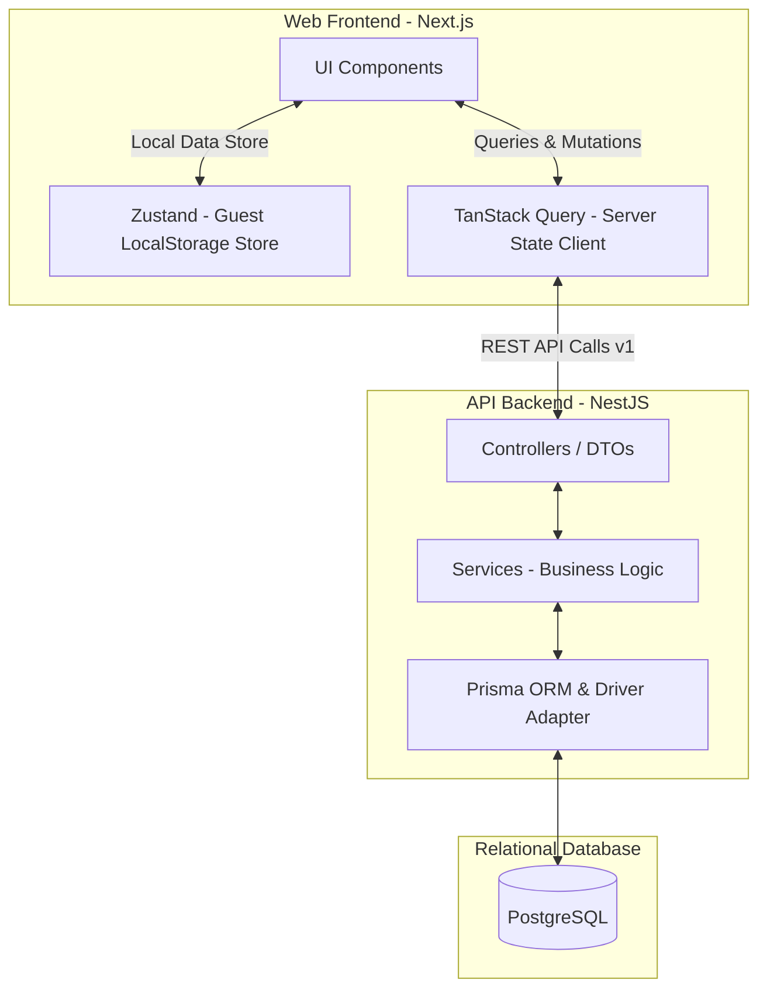

# FindMyTang - Technical Architecture (สถาปัตยกรรม ฐานข้อมูล และ API)

เอกสารนี้รวบรวมรายละเอียดด้านโครงสร้างระบบสถาปัตยกรรม โครงสร้างฐานข้อมูล (Database Schema) รายละเอียดของ API Endpoints และมาตรฐานการเขียนโค้ด (Coding Standard) ไว้ในที่เดียว

---

## 🏛️ สถาปัตยกรรมระบบ (System Architecture)

FindMyTang ใช้สถาปัตยกรรมแบบ **Client-Server Web Application** ที่ออกแบบภายใต้หลักคิด **Online-First with Guest Mode** (รองรับการใช้งานแบบออฟไลน์ผ่าน LocalStorage ก่อนแล้วจึงซิงค์ขึ้นระบบคลาวด์เมื่อล็อกอิน)



### รายละเอียดของ Stack ทางเทคโนโลยี (Tech Stack)

#### ฝั่ง Frontend (apps/web)

- **Framework**: Next.js 14+ (App Router) และ TypeScript
- **Styling**: Tailwind CSS & shadcn/ui
- **State Management (Client)**: Zustand (ใช้เก็บข้อมูลจำลองของสินทรัพย์ หมวดหมู่ และรายการธุรกรรมลงใน LocalStorage ของ Browser เมื่อผู้ใช้งานอยู่ในโหมด Guest)
- **State Management (Server)**: TanStack Query (React Query)
- **Form & Validation**: React Hook Form และ Zod

#### ฝั่ง Backend (apps/api)

- **Framework**: NestJS (TypeScript)
- **ORM**: Prisma 7
- **Database**: PostgreSQL
- **Driver Adapter**: ใช้ `@prisma/adapter-pg` และ `pg` เพื่อจัดการ Connection Pool และการเชื่อมต่อให้มีประสิทธิภาพสูงขึ้นตามข้อกำหนดของ Prisma 7

---

## 💾 โครงสร้างฐานข้อมูล (Database Schema)

ฐานข้อมูลออกแบบเพื่อรองรับการทำบัญชีแบบ Event-Sourcing Style โดยยอดคงเหลือจริง (Balance) จะได้จากการสรุปยอดธุรกรรม (Transactions) เสมอ

### Prisma Models Specification

#### 1. User (บัญชีผู้ใช้งาน)

- **User**: เก็บข้อมูลผู้ใช้งาน การตั้งค่าส่วนตัว และข้อมูลการซิงค์ (ยุบรวมตาราง Profile เข้ามารวมไว้ด้วยกัน และไม่มีการเก็บผู้ใช้ที่เป็น Guest ใน DB)
  ```prisma
  model User {
    id             String        @id @default(uuid())
    email          String        @unique
    password       String
    displayName    String?
    avatarUrl      String?
    language       String        @default("th")
    lastSyncedAt   DateTime?
    lastSyncStatus String?       // "SUCCESS" | "FAILED"
    createdAt      DateTime      @default(now())
    updatedAt      DateTime      @updatedAt
    assets         Asset[]
    categories     Category[]
    transactions   Transaction[]
  }
  ```

#### 2. Assets (สินทรัพย์และบัญชีเงิน)

- **Asset**: บัญชีสินทรัพย์ของผู้ใช้งาน (เช่น บัญชีธนาคาร, เงินสด) รองรับการ Soft Delete (`deletedAt`) และการ Archive (`isArchived`) โดยสีของ Asset สามารถเลือกตกแต่งได้ ส่วนไอคอนจะกำหนดค่าตายตัว (Fixed) ตามประเภท `AssetType`
  ```prisma
  model Asset {
    id                   String        @id @default(uuid())
    name                 String
    userId               String
    user                 User          @relation(fields: [userId], references: [id], onDelete: Cascade)
    type                 AssetType     // CASH | BANK | E_WALLET | INVESTMENT | CRYPTO | OTHER
    balance              Decimal       @default(0)
    color                String?       // ตกแต่งสีได้
    isArchived           Boolean       @default(false)
    transactions         Transaction[] @relation("AssetToTransaction")
    transferTransactions Transaction[] @relation("ToAssetToTransaction")
    deletedAt            DateTime?
    createdAt            DateTime      @default(now())
    updatedAt            DateTime      @updatedAt
  }
  ```

#### 3. Categories (หมวดหมู่รายการ)

- **Category**: แยกตามประเภท รายรับ หรือ รายจ่าย สามารถเลือกไอคอนจากชุดที่เตรียมไว้และเลือกสีตกแต่งเองได้ รองรับการ Soft Delete (`deletedAt`) เพื่อให้ประวัติธุรกรรมในอดีตยังอ้างอิงหมวดหมู่เดิมได้อยู่ และใช้การตั้งชื่อหมวดหมู่ที่เข้าใจง่ายหรือแสดงถึงความสำคัญของหมวดหมู่นั้นๆ
  ```prisma
  model Category {
    id           String        @id @default(cuid())
    name         String
    type         CategoryType  // INCOME | EXPENSE
    color        String?       // ตกแต่งสีได้
    icon         String?       // เลือกไอคอนจากชุดเริ่มต้นได้
    userId       String
    user         User          @relation(fields: [userId], references: [id], onDelete: Cascade)
    isSystem     Boolean       @default(false)
    transactions Transaction[]
    deletedAt    DateTime?
    createdAt    DateTime      @default(now())
    updatedAt    DateTime      @updatedAt
  }
  ```

#### 4. Transactions (รายการธุรกรรมทางการเงิน)

- **Transaction**: ตารางหลักที่บันทึกทุกเหตุการณ์ทางการเงิน (การได้เงิน, การจ่ายเงิน, การโอนเงิน หรือ การปรับยอดบัญชี) รองรับการเก็บไฟล์แนบ (เช่น สลิป) ได้ 1 รูปภาพต่อรายการ และประวัติการลบแบบ Soft Delete

  ```prisma
  model Transaction {
    id            String          @id @default(uuid())
    type          TransactionType // INCOME | EXPENSE | TRANSFER | ADJUSTMENT
    amount        Decimal
    note          String?
    date          DateTime
    userId        String
    user          User            @relation(fields: [userId], references: [id], onDelete: Cascade)
    assetId       String          // บัญชีหลัก หรือบัญชีต้นทาง (From Asset)
    asset         Asset           @relation("AssetToTransaction", fields: [assetId], references: [id], onDelete: Cascade)
    toAssetId     String?         // บัญชีปลายทาง (สำหรับประเภท TRANSFER เท่านั้น)
    toAsset       Asset?          @relation("ToAssetToTransaction", fields: [toAssetId], references: [id], onDelete: SetNull)
    categoryId    String?         // หมวดหมู่ (สำหรับ INCOME / EXPENSE เท่านั้น)
    category      Category?       // ใช้ Soft Delete หมวดหมู่ในการรักษาข้อมูลประวัติ
    attachmentUrl String?         // ponytail: แนบรูปภาพเดี่ยวได้ 1 รูปต่อรายการ (มีแผนขยายเป็นกลุ่มหรือหลายรูปในอนาคตเมื่อแอปโตขึ้น)
    deletedAt     DateTime?
    createdAt     DateTime        @default(now())
    updatedAt     DateTime        @updatedAt
  }
  ```

  > [!NOTE]
  > **บันทึกอนาคตเกี่ยวกับระบบไฟล์แนบสลิป/รูปภาพ (TransactionAttachment)**:
  > ฟีเจอร์การอัปโหลดไฟล์รูปภาพแนบยังคงเป็นแผนงานที่น่าสนใจในอนาคต โดยเฉพาะแนวคิดที่ต้องการให้ถ่ายรูปเก็บใบเสร็จหรือสลิปการโอนเงินไว้เป็นกลุ่มรายการ (เช่น จ่ายหมวดหมู่อาหาร 2 รายการ หมวดขนม 4 รายการ แล้วถ่ายรูปรวมสลิปหรือใบเสร็จเดียวแนบไว้) และสามารถแนบได้หลายรูป โดยจะหยิบขึ้นมาทำเมื่อตัว Product เติบโตขึ้น แต่ในเบื้องต้นจะดีไซน์โครงสร้างให้รองรับการแนบได้แค่ 1 รูปภาพต่อ 1 รายการธุรกรรมผ่านฟิลด์ `attachmentUrl` ไปก่อนเพื่อความเรียบง่ายและเป็น Working Minimum

---

## 🔄 ระบบการซิงค์ข้อมูล Guest (Guest Sync Mechanism)

- **Offline-First**: โหมด Guest จะเก็บข้อมูลบน LocalStorage ทั้งหมด **โดยไม่มีการบันทึกข้อมูลใดๆ ลงฐานข้อมูลเซิร์ฟเวอร์** จนกว่าผู้ใช้จะลงทะเบียน/ล็อกอิน
- **Merge Flow (กรณีล็อกอินเข้าบัญชีเดิม)**: เมื่อทำการล็อกอินเข้าบัญชีที่เคยมีข้อมูลอยู่แล้ว ระบบจะทำความสะอาดข้อมูลและทำการ **Merge** ข้อมูลจาก Local เข้าไปรวมกับข้อมูลเดิมบนเซิร์ฟเวอร์
  - **การแจ้งเตือน**: ฝั่ง Frontend จะต้องแสดง Popup คอนเฟิร์มความยินยอมของผู้ใช้งานก่อนจะกดยืนยันการซิงค์ข้อมูล
- **สถานะการซิงค์**: อัปเดตฟิลด์ `lastSyncedAt` และ `lastSyncStatus` ลงบนตาราง `User` โดยตรงหลังจากการซิงค์เสร็จสิ้น เพื่อความสะดวกรวดเร็วในการแสดงสถานะ เช่น "Sync just Now", "Last synced 1 minute ago" หรือ "Sync failed" บนแอปมือถือ/เว็บ

### ขั้นตอนการทำงานของ API Sync (Transaction Block)

1.  **จับคู่หมวดหมู่ (Categories)**: บันทึกหมวดหมู่ใหม่ที่ถูกสร้างขึ้นในฝั่ง Client ลงสู่ฐานข้อมูล และจัดเก็บแผนที่ของไอดีชั่วคราวคู่กับไอดีใหม่จากฐานข้อมูล (`localId` -> `newCategoryId`) ลงใน Map
2.  **จับคู่บัญชีสินทรัพย์ (Assets)**: บันทึกบัญชีสินทรัพย์ใหม่ และบันทึกข้อมูลไอดีชั่วคราวคู่กับไอดีฐานข้อมูล (`localId` -> `newAssetId`) ลงใน Map
3.  **บันทึกรายการธุรกรรม (Transactions)**: วนลูปบันทึกรายการธุรกรรมทั้งหมด โดยเปลี่ยนไอดีของสินทรัพย์ (`localAssetId`, `localToAssetId`) และหมวดหมู่ (`localCategoryId`) เป็นไอดีใหม่ที่ดึงค่ามาจากขั้นตอนที่ 1 และ 2
4.  **อัปเดตสถานะซิงค์ของ User**: ทำการบันทึกวันเวลาและผลลัพธ์ลงบนข้อมูล `User` (`lastSyncedAt = now()`, `lastSyncStatus = "SUCCESS"`)
5.  **เคลียร์ข้อมูลฝั่ง Client**: เมื่อ API ตอบรับสถานะกลับมาสำเร็จ (`success: true`) ฝั่ง Client จะทำการเรียกฟังก์ชัน `clearGuestData()` เพื่อล้างค่าใน LocalStorage ทิ้งทั้งหมด และสลับการทำงานเป็น Online Mode

---

## 📡 รายละเอียดข้อกำหนด API (API Specification v1)

- **Base URL**: `/api/v1`
- **Format**: Application/JSON
- **Authentication**: JWT Bearer Token แบบไร้สถานะ (Stateless JWT) (ส่งผ่าน Headers: `Authorization: Bearer <accessToken>`)

### 1. หมวดหมู่การยืนยันตัวตนและการจัดการโปรไฟล์ (Auth & Profile)

- `POST /auth/register` : สมัครสมาชิกใหม่ (ส่งข้อมูล `email`, `password`, `displayName`)
- `POST /auth/login` : เข้าสู่ระบบรับ JWT (ส่งข้อมูล `email`, `password`)
- `POST /auth/sync-guest` : ซิงค์ข้อมูลจาก Local ของ Guest ขึ้นคลาวด์ (ส่งโครงสร้าง Array ของ `assets`, `categories`, `transactions` พร้อมไอดีฝั่งโลคอลเพื่อจับคู่บนเซิร์ฟเวอร์ ทำการ Merge ข้อมูลเข้ากับบัญชีที่มีอยู่เดิม)
- `PATCH /users/profile` : อัปเดตข้อมูลโปรไฟล์และการตั้งค่าผู้ใช้ (ส่งข้อมูล `displayName`, `avatarUrl`, `language`)

### 2. หมวดหมู่บัญชีสินทรัพย์ (Assets)

- `GET /assets` : ดึงรายการบัญชีสินทรัพย์ทั้งหมดของผู้ใช้งานปัจจุบัน (กรองเฉพาะรายการที่ `deletedAt == null`)
- `POST /assets` : สร้างบัญชีสินทรัพย์ใหม่ (ส่งข้อมูล `name`, `type`, `balance`, `color`) // ไอคอนจะฟิกซ์ตามประเภทของสินทรัพย์ที่ส่งไป
- `PATCH /assets/:id` : แก้ไขรายละเอียดบัญชีสินทรัพย์ หรือส่ง `isArchived: true/false` เพื่อสลับการเก็บเข้าคลัง
- `DELETE /assets/:id` : ทำ Soft Delete บัญชีสินทรัพย์ออกจากระบบ (ไม่กระทบและไม่ลบรายการ Transactions เดิม)

### 3. หมวดหมู่ของรายการประเภท (Categories)

- `GET /categories` : ดึงหมวดหมู่ทั้งหมดของผู้ใช้งานปัจจุบัน (รวมถึงหมวดหมู่เริ่มต้นจากระบบ)
- `POST /categories` : สร้างหมวดหมู่ส่วนตัวของผู้ใช้ (ส่งข้อมูล `name`, `type`, `color`, `icon`)
- `PATCH /categories/:id` : แก้ไขรายละเอียดหมวดหมู่ (ชื่อ, สี, หรือไอคอน)
- `DELETE /categories/:id` : ทำ Soft Delete หมวดหมู่ (ไม่กระทบและไม่ลบรายการ Transactions เดิม)

### 4. หมวดหมู่รายการบันทึก (Transactions)

- `GET /transactions` : รายการบันทึกทั้งหมด รองรับ Pagination และ Query Parameters ในการกรองข้อมูล (ประเภท, บัญชี, วันที่)
- `POST /transactions` : บันทึกธุรกรรมใหม่ (ส่ง `type`, `amount`, `date`, `assetId`, `categoryId`, `note`, `toAssetId`, `attachmentUrl`)
- `PATCH /transactions/:id` : แก้ไขประวัติข้อมูลธุรกรรม
- `DELETE /transactions/:id` : ทำ Soft Delete รายการธุรกรรม

### 5. หมวดหมู่รายงานและวิเคราะห์ข้อมูล (Analytics)

- `GET /analytics/summary` : รายรับรวม รายจ่ายรวม และกระแสเงินสดสุทธิ (Net Flow) รายเดือนสำหรับแสดงผลหน้า Home
- `GET /analytics/categories` : สัดส่วนและยอดสรุปรายจ่ายแยกตามหมวดหมู่ประจำเดือน
- `GET /analytics/trends` : ข้อมูลแนวโน้มรายรับ-รายจ่ายย้อนหลังแยกรายเดือน

---

## 🛠️ มาตรฐานการเขียนโค้ด (Coding Standards)

1.  **Type Safety (TypeScript)**: ห้ามการใช้ชนิดข้อมูลแบบ `any` ในโค้ดโดยเด็ดขาด หากไม่ทราบชนิดข้อมูลที่แน่นอนให้ใช้ `unknown` แทน
2.  **Frontend Architecture (Feature-Based)**:
    - จัดหมวดหมู่โค้ดแยกตามโมดูลหลักของฟีเจอร์ใน `apps/web/src/features/<feature_name>/`
    - แยกสัดส่วนระหว่าง **Presentation Component** (ส่วนการแสดงผล UI ที่ไม่มี Side-effects และพึ่งพา Props เท่านั้น) และ **Container Component** (ส่วนควบคุมสถานะ เรียกใช้ Hooks และ Logic การเชื่อมต่อข้อมูล) ตามข้อกำหนดใน [AGENTS.md ของฝั่ง Web](file:///Users/torikiton/Desktop/FindMyTang/apps/web/AGENTS.md)
3.  **Backend Standards (NestJS Modular)**:
    - จำแนกโค้ดออกเป็น Module, Controller และ Service
    - ใช้ Class-Validator และ DTOs ในการคัดกรองความถูกต้องของข้อมูล (Request Validation)
4.  **Database Guidelines**:
    - การตั้งชื่อตารางและฟิลด์จะใช้ `camelCase` ในไฟล์ `schema.prisma` เพื่อความเรียบง่ายและไม่ต้องการสร้างความซับซ้อนด้วยการใช้ `@map` และ `@@map` ในการย้ายรูปแบบตัวสะกดในฝั่ง Database (ยกเว้นตารางระบบดั้งเดิมที่มีความสอดคล้องกันอยู่แล้ว)
    - การทำงานที่มีการเขียนข้อมูลลงมากกว่า 1 ตารางพร้อมกัน (เช่น ในระบบซิงค์) ต้องครอบการทำงานด้วย `$transaction` เสมอ เพื่อรักษาความปลอดภัยของสิทธิ์ข้อมูล
