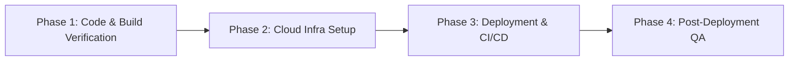

# Sprint 6: Production Readiness & Cloud Deployment Plan (แผนการนำระบบขึ้นบรรจุใช้งานจริง)

> **เป้าหมายหลัก:** ขัดเกลาคุณภาพแอปพลิเคชัน (Polish & QA) และดำเนินการนำระบบขึ้นสู่เซิร์ฟเวอร์จริง (Production Cloud Deployment)

---

## 📌 1. ภาพรวมเป้าหมาย (Sprint Goal)

หลังจากที่ระบบ FindMyTang ได้ผ่านการพัฒนาโครงสร้างพื้นฐาน (Sprint 0), โมดูลสินทรัพย์และหมวดหมู่ (Sprint 1), ระบบบันทึกและธุรกรรมขั้นสูง (Sprint 2), หน้าจอแดชบอร์ดหลัก (Sprint 3), ระบบวิเคราะห์ข้อมูล Analytics (Sprint 4) และการเพิ่มความเข้มงวดด้านความปลอดภัย Security Hardening & Performance Optimization (Sprint 5) สำเร็จ 100% แล้ว

**Sprint 6** มีเป้าหมายเพื่อนำแอปพลิเคชันส่งมอบขึ้นสู่ Production Environment อย่างเต็มรูปแบบ โดยเน้นที่:

1. การตรวจสอบความสมบูรณ์ของโค้ดและการสร้าง Production Build (Build Integrity & Zero-Error Check)
2. การจัดเตรียมโครงสร้างพื้นฐาน Cloud (Cloud PostgreSQL Database & Production Hosting Setup)
3. การติดตั้งและเชื่อมต่อระบบจริง (Frontend Web & Backend API Deployment with CI/CD)
4. การทดสอบแบบครบวงจรหลังการติดตั้ง (Post-Deployment E2E Testing & User Experience Validation)

---

## 📐 2. รายละเอียดขั้นตอนการดำเนินงาน (Task Breakdown)

แผนงานใน Sprint 6 แบ่งออกเป็น **4 เฟสหลัก** ดังนี้:



### Phase 1: การตรวจสอบและขัดเกลาความพร้อมของโค้ด (Build Verification & Code Polish)

- [x] **1.1 Frontend Web Verification (`apps/web`):**
  - [x] ดำเนินการทดสอบ build Production Bundle (`cd apps/web && npm run build`)
  - [x] ตรวจสอบและแก้ไข TypeScript errors, unused variables และ hydration warnings
  - [x] ตรวจสอบ responsive design และ micro-interactions บน Mobile / Desktop
- [x] **1.2 Backend API Verification (`apps/api`):**
  - [x] ดำเนินการทดสอบ build Production App (`cd apps/api && npm run build`)
  - [x] ตรวจสอบการทำงานของ Prisma Client Generation (`npx prisma generate`)
  - [x] ตรวจสอบ Security Headers (Helmet), Rate Limiting (Throttler), และ Exception Filters
- [x] **1.3 WebApp Rebranding, UI Polish & Legal Preparation (`apps/web`):**
  - [x] **เปลี่ยนชื่อ WebApp ใหม่ (Rebranding):** อัปเดตชื่อแอปพลิเคชันเป็น FindMyTang ทั่วทั้งซอร์สโค้ดและเอกสารกำกับระบบ (`docs/`) เรียบร้อยแล้ว
  - [x] **ทำ SEO WebApp (Dynamic Multi-Language SEO):**
    - [x] กำหนด OpenGraph Metadata (`og:title`, `og:description`, `og:siteName`, `locale: th_TH`, `alternateLocale: ['en_US']`) ใน `layout.tsx` สำหรับ Search Engine Crawlers
    - [x] ทำระบบ Dynamic Document Title & Meta Description ในฝั่ง Client ให้เปลี่ยนภาษา TH ↔ EN อัตโนมัติตาม `useTranslation()` เมื่อผู้ใช้สลับภาษาในแอป
  - [x] **กำหนด Version WebApp:** ระบุหมายเลขเวอร์ชันระบบ `v1.0.0` ใน `apps/web/package.json` และแสดงผลบน UI
  - [x] **ปรับปรุงหน้า Settings & UI Polish:**
    - [x] ใส่ข้อความ `© 2026 FindMyTang. All rights reserved.` คู่กับ Version `v1.0.0` ที่ล่างสุดของหน้า Settings
    - [x] เพิ่มปุ่มสำหรับกดเปิดอ่าน Terms of Service และ Privacy Policy ในส่วน Footer ของหน้า Settings
    - [x] ปรับแต่งโทนสีและดีไซน์ UI ให้มีความสวยงาม ลงตัว และพรีเมียมยิ่งขึ้น
  - [x] **ปรับแต่งหน้า Auth (Login/Register):**
    - [x] ซ่อนลิงก์ "Forgot password?" ชั่วคราว
    - [x] ซ่อนปุ่ม "Continue with Google" ชั่วคราว
  - [x] **สร้างหน้าข้อตกลงและนโยบาย (Legal Pages):**
    - [x] สร้าง Modal Dialog แสดงเนื้อหา Terms of Service (เงื่อนไขและข้อตกลงการใช้งาน) ในแอปแบบไม่ต้องเปลี่ยนหน้า
    - [x] สร้าง Modal Dialog แสดงเนื้อหา Privacy Policy (นโยบายความเป็นส่วนตัว) ในแอปแบบไม่ต้องเปลี่ยนหน้า

---

### Phase 2: การจัดเตรียมฐานข้อมูลและสภาพแวดล้อม Cloud (Cloud Infrastructure & Environment Setup)

- [x] **2.1 Cloud PostgreSQL Database Setup:**
  - [x] จัดตั้ง Cloud PostgreSQL Database บน Supabase
  - [x] ทดสอบการเชื่อมต่อ `DATABASE_URL` จากเครื่อง Local ไปยัง Cloud Database
  - [x] ดำเนินการ Prisma Database Migration บน Cloud (`npx prisma migrate deploy`) — 7 migrations applied
  - [x] ดำเนินการ Seed Initial Category Data สำหรับผู้ใช้งานใหม่ — 20 categories created
- [x] **2.2 Production Environment Variables Preparation:**
  - [x] จัดทำและตรวจสอบความถูกต้องของ Production Environment Variables:
    - **Backend (`apps/api`):**
      - `DATABASE_URL` ✅
      - `JWT_SECRET` & `JWT_ACCESS_SECRET` ✅ (generated secure 64-char)
      - `ALLOWED_ORIGINS` ✅ (https://findmytang.vercel.app)
      - `THROTTLE_TTL` & `THROTTLE_LIMIT` ✅
      - `SUPABASE_URL`, `SUPABASE_BUCKET`, `SUPABASE_SERVICE_ROLE_KEY` ✅
    - **Frontend (`apps/web`):**
      - `NEXT_PUBLIC_API_URL` (รอ Render URL จาก Phase 3)

---

### Phase 3: การติดตั้งระบบขึ้น Cloud Hosting (Deployment & Integration)

- [ ] **3.1 Backend Deployment (`apps/api`):**
  - [ ] เลือกและตั้งค่าบริการ Host (เช่น Render, Railway, Fly.io)
  - [ ] กำหนดค่า Build Command (`npm run build`) และ Start Command (`npm run start:prod`)
  - [ ] ตั้งค่า Health Check Endpoint (`GET /api/v1/health` หรือ `GET /api`)
  - [ ] ทดสอบ API Key, CORS Policies และ Rate Limiting บน Production
- [ ] **3.2 Frontend Deployment (`apps/web`):**
  - [ ] เลือกและตั้งค่า Vercel Project สำหรับ Next.js App
  - [ ] กำหนด Environment Variable `NEXT_PUBLIC_API_URL`
  - [ ] เชื่อมต่อ Git Repository สำหรับ Auto-Deployment (CI/CD)
  - [ ] ตั้งค่า Custom Domain และ HTTPS / SSL Certificate (ถ้ามี)

---

### Phase 4: การทดสอบหลังติดตั้งและการส่งมอบ (Post-Deployment E2E QA)

- [ ] **4.1 End-to-End User Flow Validation:**
  - [ ] ทดสอบการลงทะเบียนสมัครสมาชิก (Register) และเข้าสู่ระบบ (Login) บน Production Web
  - [ ] ทดสอบการเพิ่ม/แก้ไข/ลบ สินทรัพย์ (Assets) และ หมวดหมู่ (Categories)
  - [ ] ทดสอบการบันทึกธุรกรรม (Income, Expense, Transfer, Adjustment)
  - [ ] ทดสอบการแสดงผล Home Dashboard และ Analytics Graphs
  - [ ] ทดสอบพฤติกรรม Rate Limiting (429 Toast Notification) ในสภาวะใช้งานจริง
- [ ] **4.2 Final Sign-Off & Documentation Update:**
  - [ ] อัปเดตสถานะใน [STATUS.md](file:///Users/torikiton/Desktop/FindMyTang/docs/STATUS.md) และ [DEPLOYMENT_PREPARATION.md](file:///Users/torikiton/Desktop/FindMyTang/docs/DEPLOYMENT_PREPARATION.md) เป็น Completed 100%

---

## 🛠️ 3. แผนการตรวจสอบและวัดผล (Verification Plan)

### คำสั่งตรวจสอบอัตโนมัติ (Automated Build & Check Commands)

```bash
# 1. ทดสอบ Build ฝั่ง Frontend Web
cd apps/web && npm run build

# 2. ทดสอบ Build ฝั่ง Backend API
cd apps/api && npm run build

# 3. ตรวจสอบสถานะ API Health Check บน Production
curl -I https://<your-api-domain>/api
```

---

## 📝 4. บันทึกและหมายเหตุ (Notes & Next Actions)

เมื่อดำเนินการตามแผนงาน Sprint 6 นี้เสร็จสมบูรณ์ โครงการ FindMyTang จะพร้อมสำหรับผู้ใช้จริงในรูปแบบ Production Web Application อย่างเต็มประสิทธิภาพ
